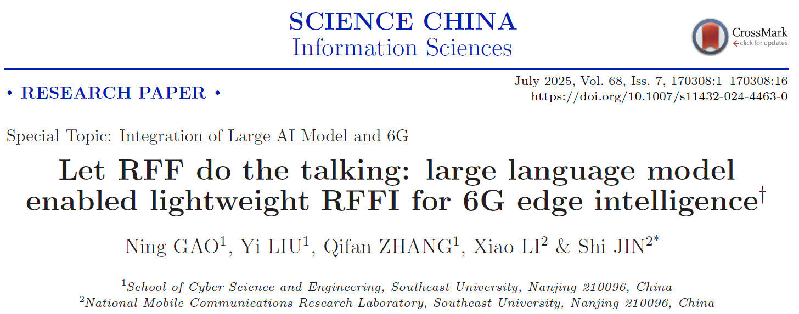
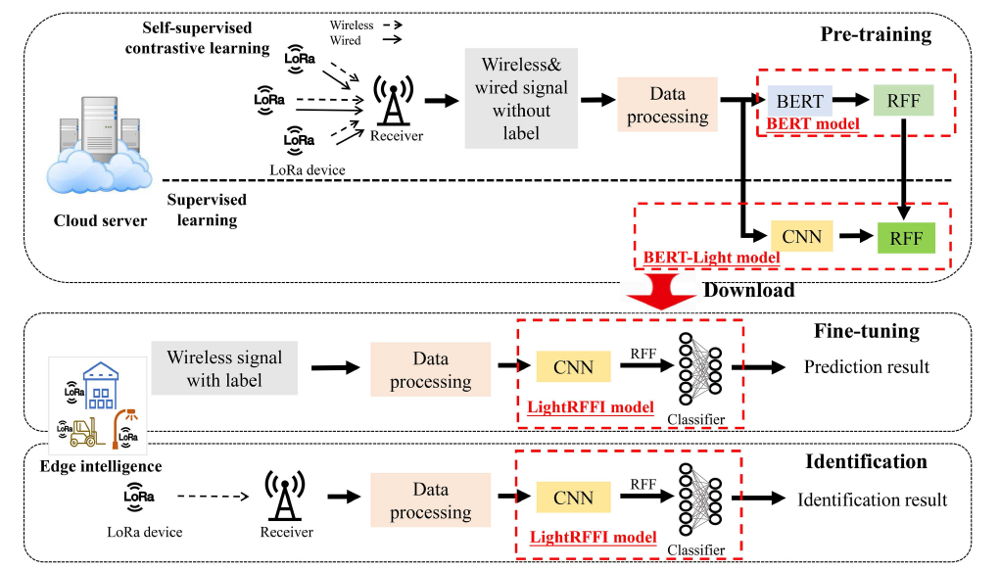
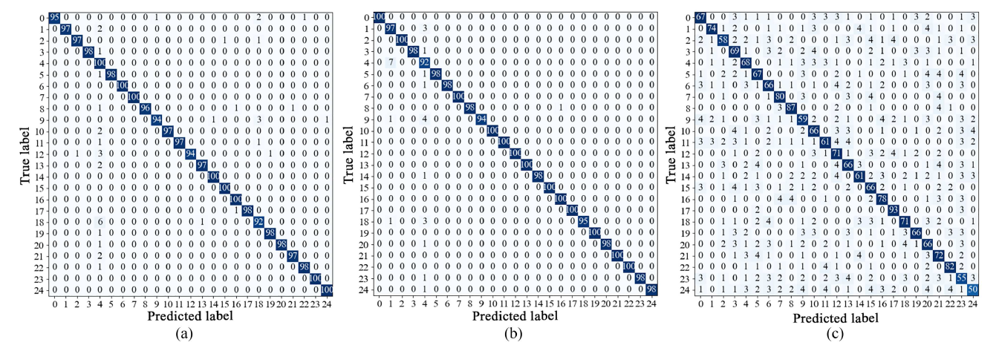
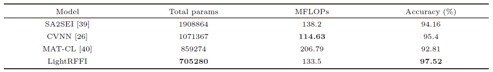

# BERT-LightRFFI: Large Language Model-Enabled Lightweight RF Fingerprint Identification for 6G Edge Intelligence

# Language Options
- [English](README.en.md)
- [中文](README.md)



This repository introduces the BERT-LightRFFI framework proposed in the paper **“Let RFF do the talking: large language model enabled lightweight RFFI for 6G edge intelligence”**, [available here](paper.pdf), which has been officially published in *SCIENCE CHINA Information Sciences* (2025).

## 🧩 Research Motivation
Currently, the sixth-generation mobile communication (6G) is rapidly developing worldwide, aiming to achieve global high-speed wireless coverage within the next decade. It will provide faster transmission speeds, higher capacity, and near-zero latency communication experiences. However, due to the openness of wireless networks, the massive number of edge IoT devices frequently accessing the network poses significant security risks. Although upper-layer authentication technologies can alleviate such threats, they often fail to meet the low-latency and low-power requirements of edge intelligence applications. Moreover, existing upper-layer security mechanisms cannot fully accommodate the heterogeneous and massive IoT devices. Therefore, RF fingerprint identification (RFFI) technology, as a lightweight and low-latency identity authentication method, has great potential as a security solution for “zero-trust” IoT access. RF fingerprints are derived from subtle hardware imperfections introduced during the manufacturing process of IoT devices. These imperfections leave unique "fingerprints" on the RF signals when the device transmits data. This fingerprint information is difficult to forge and serves as a sub-bit-level identity credential. RFFI identifies devices based on these unique features in RF signals.

## 📖 Overview
This study is the first to integrate LLMs with RFFI. It considers a star-topology LoRa edge intelligence network in outdoor scenarios, where the RFFI model is deployed on edge gateways for secure access control. To address the limitations of current deep learning-based RFFI methods—such as high training cost, limited labeled data, and poor scalability—this work proposes a BERT-based lightweight RFFI framework named BERT-LightRFFI to enhance secure access in zero-trust edge IoT networks. The BERT-LightRFFI framework consists of three models: the BERT model, the BERT-Light model, and the LightRFFI model. Specifically, a powerful RFF feature extractor is first obtained by pretraining a BERT model with self-supervised contrastive learning on unlabeled data. Then, knowledge distillation is used to transfer the learned features from BERT to the lightweight BERT-Light model. Finally, a small amount of labeled wireless data is used to fine-tune the BERT-Light model and the classifier for specific scenarios.

## 🚀 Innovations
- **First integration of LLMs with RF fingerprint identification:** Specifically, a BERT model is pretrained using self-supervised contrastive learning on line and wireless signal datasets provided by manufacturers or labs. Then, knowledge distillation is applied to transfer the knowledge from BERT to the lightweight BERT-Light model, enabling lightweight and high-performance RFF feature extraction;
- **Innovative embedded algorithm design:** To align signal data with LLMs, a wireless LLM is constructed based on signal characteristics. An embedding algorithm is redesigned to segment RFF data into word vectors, and semantic features from these vectors are used to pretrain the BERT model;
- **Edge intelligence support:** The LightRFFI model deployed on edge IoT devices is architecture-agnostic. It can flexibly adopt mature or custom model structures, requiring only a small amount of labeled data for fine-tuning before deployment. This solves real-world issues such as poor model scalability and lack of labeled data, allowing adaptive use in various communication scenarios.

The detailed BERT-LightRFFI architecture is illustrated below.  


## ⚙️ Experimental Results
All experiments were conducted on a server equipped with an NVIDIA Tesla V100 (32 GB) GPU, Intel Xeon E5-2698 CPU, and 512 GB RAM. The proposed framework was evaluated on a large-scale real-world LoRa dataset. To explore the RFFI performance of the BERT model, besides using the BERT-LightRFFI framework to obtain the LightRFFI model, a classifier was also trained directly on the BERT model to derive the BERT-RFFI model. Confusion matrices of BERT-RFFI, LightRFFI, and the LightRFFI model without knowledge distillation (LightRFFI-NKD) are shown below. Results show that without knowledge distilled from the BERT model, lightweight models struggle to effectively extract RFF features from wireless data. The proposed framework achieved 97.52% accuracy even under multipath fading and Doppler effects. Interestingly, the distilled LightRFFI model even outperformed the original BERT model, demonstrating the principle of "the student surpasses the master."



## 📊 Performance Comparison
This study compares the proposed framework with state-of-the-art baselines using contrastive learning and few-shot learning, including SA2SEI, CVNN, and MAT-CL. The table below presents the performance comparison. It is evident that the proposed LightRFFI model outperforms the three baselines in terms of both parameter count and accuracy. This advantage is attributed to BERT’s capability to extract fine-grained RFF features and the effective knowledge distillation from BERT to BERT-Light.



## ⚙️ Code Usage
The code of this study is publicly available. Key components include:

- **[embedding.py](embedding.py):** Contains modifications to the embedding layer in this study;
- **[model.py](model.py):** Contains the BERT model implementation and the multi-head attention mechanism definitions;
- **[KDtrain.py](KDtrain.py):** Implements the knowledge distillation algorithm and execution logic;
- **[train.py](train.py):** Contains training routines for the BERT model;
- **[run.py](run.py):** Project entry point; run this script to generate results.

## 📖 Citation
If you use this work in your research, please cite:
```bibtex
@article{gao2025rff,
  title={Let RFF do the talking: large language model enabled lightweight RFFI for 6G edge intelligence},
  author={Gao, Ning and Liu, Yi and Zhang, Qifan and Li, Xiao and Jin, Shi},
  journal={SCIENCE CHINA Information Sciences},
  volume={68},
  number={7},
  pages={170308},
  year={2025},
  doi={10.1007/s11432-024-4463-0}
}
