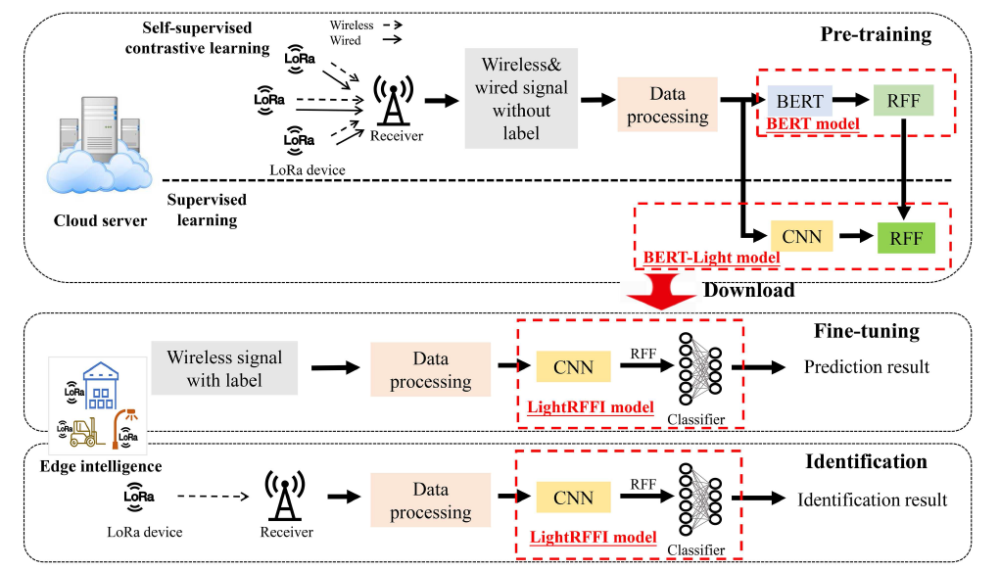
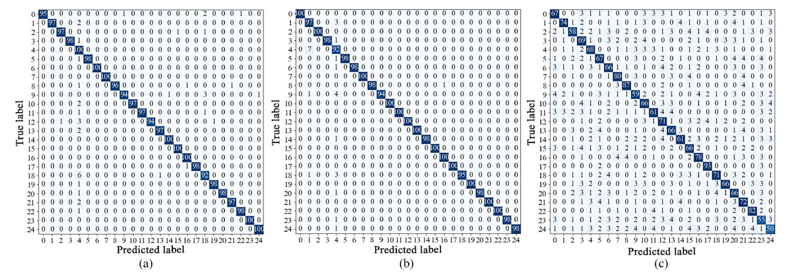
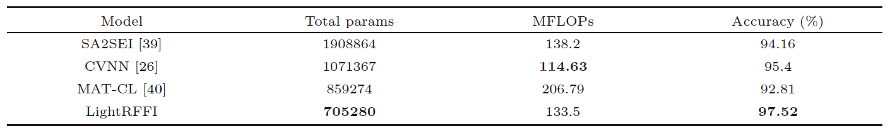

# BERT-LightRFFI: 面向6G边缘智能的大语言模型驱动轻量化射频指纹识别

# 语言选择
- [English](README.en.md)
- [中文](README.md)


本仓库用于介绍在论文 **《Let RFF do the talking: large language model enabled lightweight RFFI for 6G edge intelligence》** 中所提出的BERT-LightRFFI框架，[此论文](paper.pdf)已公开发表在*SCIENCE CHINA Information Sciences* (2025)。


## 🧩 研究意义
当前，第六代移动通信（6G）正在全球范围内加速发展，在未来十年内将实现全球范围的高速无线覆盖，为用户带来更快的传输速度、更高的容量以及接近零时延的通信体验。然而，由于无线网络的开放性，海量边缘物联网设备频繁访问网络会导致严重的安全风险，虽然上层身份认证技术能够缓解这种安全威胁，但很大程度上无法满足边缘智能应用对低延迟和低功耗的要求，同时现有的上层安全机制无法完全兼容异构的海量物联网设备。因此，射频指纹识别技术(RFFI)作为一种轻量化、低时延的身份识别方法，成为“零信任”物联网接入的潜在安全方案，非常具有应用前途。射频指纹源自于物联网设备在生产过程中因制造工艺差异产生细微的硬件缺陷，当设备发送信号时硬件缺陷会在射频信号上留下独特的“指纹”信息，该信息具有难以伪造的特点，是一种超越比特级的身份凭证。射频指纹识别正是基于射频信号特征进行设备身份识别。

## 📖 概述
本项研究首次尝试将LLM与RFFI相结合。考虑了室外场景下的星形拓扑的LoRa边缘智能网络，其中RFFI模型部署在边缘网关设备上用于安全接入控制。为应对当前基于深度学习方法RFFI 存在训练开销大、标记数据有限，模型可扩展性差的局限性，本项研究提出了一种基于BERT大模型的轻量化RFFI框架，即BERT-LightRFFI框架，以增强零信任边缘物联网的接入安全。BERT-LightRFFI框架包含三部分模型，分别是BERT模型、BERT-Light模型和LightRFFI模型。具体而言，首先，通过自监督对比学习用未标记的数据预先训练一个BERT模型，获得一个强大的RFF特征提取器。然后，使用知识蒸馏将BERT学习基因继承到轻量化的BERT-Light模型，最后，根据具体场景使用少量标记的无线数据对BERT-Light模型和分类器进行微调。

## 🚀 创新性
- **首次将大语言模型与射频指纹识别技术相结合：** 具体而言，首先，大模型使用有制造商或者实验室提供的线信号和无线信号作为数据集，通过自监督对比学习对BERT模型进行预训练，然后，使用知识蒸馏将BERT的训练知识蒸馏到BERT-Light模型，以实现轻量化、高性能的RFF特征提取；
- **嵌入式算法创新：** 为了将信号数据与LLM匹配，针对信号特点构建无线LLM，重新设计了信息嵌入算法，创新性的将RFF数据划分为词向量，通过提取词向量的语义特征对BERT进行预训练；
- **边缘智能：** 边缘物联网设备上的LightRFFI模型与模型结构无关，可以根据需求灵活的使用成熟的模型结构或者自开发的模型结构，仅使用少量标记数据集对其进行微调即可部署，解决了现实情况中模型可扩展性差、标记数据缺乏的问题，能够灵活地自适应各种通信场景。

具体的BERT-lightRFFI架构如下图所示。


## ⚙️ 实验结果
所有实验均在配置了NVIDIA Tesla V100 (32 GB) GPU、Intel Xeon E5-2698 CPU和 512 GB RAM的服务器上进行。实验使用了大规模的真实世界采集的LoRa数据集评估所提出的框架的性能。为了探索BERT模型的RFFI性能，除了基于BERT的BERT-LightRFFI框架获取LightRFFI模型外，实验为BERT训练相同的分类器，得到BERT-RFFI模型。BERT-RFFI模型、LightRFFI模型以及未经知识蒸馏的的LightRFFI模型(LightRFFI-NKD)的混淆矩阵分别如下图所示。结果可以看出，如果不依赖BERT模型的知识，轻量化模型很难有效地从无线数据中提取RFF特征。结果证明了所提出的框架的有效性，在存在多径衰落和多普勒效应的情况下实现了97.52%的准确率，更有趣的是BERT蒸馏后的LightRFFI模型性能超越了原先的BERT的性能，展示出“青出于蓝胜于蓝“的效果。



## 📊 性能对比

本项研究将所提出的框架与应用对比学习和小样本学习的最新基准方法进行了比较，包括 SA2SEI、CVNN和 MAT-CL。下表提供了三种基准方法的性能比较，可以看出所提出的LightRFFI模型在参数数量和准确性方面都优于其他三种基准方法。此结果得益于BERT模型提取细粒度RFF特征的能力，以及将BERT的知识传递给BERT-Light模型的知识蒸馏能力。



## ⚙️ 代码使用
本项研究的代码已公开可用，代码功能介绍如下：

- **[embedding.py](embedding.py):**  代码中包含本项研究中对嵌入层的修改；
- **[model.py](model.py):**  代码中包含了本项研究所使用的BERT模型，以及BERT中多头注意力机制等函数的具体定义；
- **[KDtrain.py](KDtrain.py):**  代码中包含了知识蒸馏算法的具体定义与执行逻辑等；
- **[train.py](train.py):**  代码中包含了BERT模型的训练方法；
- **[run.py](run.py):**  项目运行入口，直接运行此脚本以生成结果。

## 📖  引用
如果您在研究中使用了本工作，请引用：
```bibtex
@article{gao2025rff,
  title={Let RFF do the talking: large language model enabled lightweight RFFI for 6G edge intelligence},
  author={Gao, Ning and Liu, Yi and Zhang, Qifan and Li, Xiao and Jin, Shi},
  journal={SCIENCE CHINA Information Sciences},
  volume={68},
  number={7},
  pages={170308},
  year={2025},
  doi={10.1007/s11432-024-4463-0}
}
